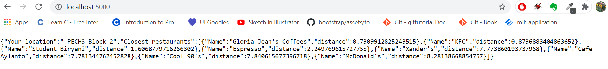

# Mobile-Apps-Assignments
Contains all my assignments for the class Application Development for Mobile Devices, which I took in my 6th semester.  

## Assignment-1: Location-based query for Restaurants  
**Required:**  
Create an API to display some restaurants closest to your own location.  
Steps to perform:
1. Insert some data for restaurants into your database
2. Each restaurant data will have restaurant name, their latitude and longitude values
3. Code in your own latitude and longitude location
4. Retrieve all restaurants, calculate their distance from your location
5. Sort them by nearest distance
6. And then display the restaurants in sorted order, based on nearest to your own location  
**Output:**  

